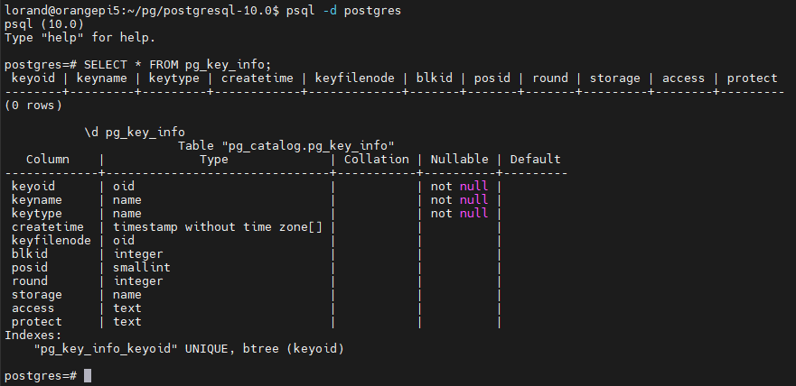

[toc]

# 1 特性背景

# 2 实现方案
## 2.1 系统表
### 1. pg_key_info 密钥信息

| keyoid | keyname | type | alrotithm | storage | access | protect | create_time | round |
| - | - | - | - | - | - | - | - | -|
| 1 | mk_1 | master_key | any | localkms | path=./keyfile | $pass1 | 2024/02/01 13:01:01 | - |
| 2 | dk_1 | date_key | aes_256_cbc | database | m100.d100.b1.i2 | mk1 | 2024/02/01 13:01:01 | 0 |

### 2. pg_key_data 密钥数据

| oid | keydata | algorithm |
| - | - | - |
| 3 | abcd1234 | aes_256 |

### 3. pg_encryption 加密对象
| type | database | schema | relname | colname | special | protect | oldest_round | ref |
|-|-|-|-|-|-|-|-|-|
| table | db1 | sch1 | t1 | c1 | - | dk_1 | 1 | d100.s100.r100_m100.d100.b1.i2 | 

## 2.2 定义表
1. 定义表
定义表的语法与非加密表一致，我们通过单独的语法定义ENCRYPTION。
```sql
CREATE TABLE t1 (c1 INT, c2 TEXT);
```

2. 定义索引
```sql
CREATE INDEX i1 ON t1 (c1);
```

## 2.3 定义表加密
1. 定义主密钥
```sql
CREATE KEY mk_1 (type=master_key, storage=localkms, access='./keyfile', protect='$pass1');
```
2. 定义数据密钥
```sql
CREATE KEY dk_1 (type=data_key, protect=mk_1, algorithm=aes_256_cbc);
```

3. 定义表加密
表上的索引默认不加密
```sql
CREATE ENCRYPTION (protect=dk_1) ON TABLE t1;
```

4. 定义表上索引加密
```sql
CREATE ENCRYPTION (protect=dk_1) ON TABLE t1 WITH (index=on);
```

5. 定义表上xlog加密
```sql
CREATE ENCRYPTION (protect=dk_1) ON TABLE t1 WITH (index=on, xlog=on);
```

6. 定义索引加密
```sql
CREATE ENCRYPTION (protect=dk_1) ON INDEX i1;
```

## 2.4 操作表
1. 写入数据
```sql
INSERT INTO t1 VALUES (1, 'aaaaa');
```
2. 查询数据
```sql
SELECT * FROM t1;
```

## 2.5 管理表加密
1. 查看表加密
```sql
SELECT * FROM pg_encryption;
```

2. 修改表加密的密钥
```sql
ALTER ENCRYPTION (protect=dk_2) ON TABLE t1;
```

3. 删除表加密
```sql
DROP ENCRYPTION ON TABLE t1;
```

## 2.6 管理主密钥
1. 查看主密钥信息
```sql
SELECT * FROM pg_key_info WHERE type = 'master_key';
```

2. 修改主密钥
```sql
ALTER KEY mk_1 SET (access='./keyfile2');
```

3. 删除主密钥
```sql
DROP KEY mk_1;
```

## 2.7 管理数据密钥
1. 查看数据密钥信息
```sql
SELECT * FROM pg_key_info WHERE type = 'data_key';
```

2. 查看数据密钥密文
```sql
SELECT * FROM pg_key_data;
```

3. 轮转数据密钥
```sql
ROTATION KEY dk_1;
```

4. 修改数据密钥
```sql
ALTER KEY dk_1 SET (protect=mk_2);
```

5. 收集旧版本数据密钥信息
```sql
VACUUM FULL t1;
```

6. 回收旧版本数据密钥
```sql
VACUUM KEY dk_1;
```

7. 删除数据密钥
```sql
DROP KEY dk_1;
```

## 2.8 未来计划
### 一、功能补充
1. 在ENCRYPTION与KEY，KEY与KEY之间，添加DEPENDENCY约束
2. 为ENCRYPTION和KEY添加ACL，控制访问权限

### 二、语法复用
1. 定义列加密
该种定义可用于全密态数据库
```sql
CREATE ENCRYPTION (protect=dk_1) ON COLUMN t1(c1);
```

2. 定义表空间加密
```sql
CREATE ENCRYPTION (protect=dk_1) ON TABLESPACE spc1;
```

3. 定义数据库加密
```sql
CREATE ENCRYPTION (protect=dk_1) ON DATABASE spc1;
```

4. 定义xlog加密
```sql
CREATE ENCRYPTION (protect=dk_1) ON XLOG;
```

# 3 关键设计
## 3.1 格式设计
- Page格式
```c
+---------------+
| PageHeader    | 在Header中，标记Page属于加密表，并标记加密状态
|               |
| tuple ..      |
| tuple 2       |
| tuple 1       |
| PageSpecial   | 在Special中，记录密钥信息
+---------------+
```
- PageSpecial格式
```c
typedef struct {
    uint8 version;
    uint8 algo;
    Tid   datakeypos;
    uchar iv[16];
    uchar mac[32];
} PageEncInfo;
```

## 3.2 流程设计
### 整体流程
```java
@user
    create table t1 (.. dk_1)
@user:
    insert into t1 (..abc)
@kernel.postgres:
    heap_insert(t1, 'abc')
    page_init(t1.dk_1, page)
        memcpy(page, get_enc_info(t1.dk_1))
        page_set_flag(page, tde_flag)
    page_add_item(page, 'abc')
@kernel.checkpoint:
    smgrwrite(page)
        if (is_page_set_flag(page, tde_flag))
            page_encrypt_date(page)
```
### 加密粒度
### 加密时机
### 加密判断
### 密钥存储
### 解密时机
### 解密判断
### 密钥来源

## 3.3 其他设计

## 3.2 主备密钥同步
```python
# 主机
page_init(page, encinfo)
    memcpy(page, encinfo)
```

# 4 特性源码
## 4.1 功能概览
### 基本功能篇
1. 新增系统表：pg_key_info
2. 新增系统表：pg_key_data
3. 新增语法：CREATE KEY
4. 新增语法：CREATE TABLE .. (encrypt=xx)
5. 加密判断与密钥存储
6. 解密判断与密钥来源

### 高级功能篇
1. 索引的加密判断与密钥存储
2. 
3. 加密Redo Log

### 加强篇
1. 新增视图

## 4.2 新增系统表 pg_key_info
1. 查找oid
```bash
cd $PGCODE/src/include/catalog
chmod +x ./unused_oids
./unused_oids
```
4001

2. 新增头文件 pg_key_info.h
```bash
touch pg_key_info.h
git add ./pg_key_info.h
```
```c
#ifndef 
```

3. 编译头文件
```bash
cd $PGCODE/src/backend/catalog
vi Makefile

# add pg_key_info.h
```

4. 添加缓存 skip now
```bash
cd $PGCODE/src/include/catlog
vi indexing.h
```

```c
DECLARE_UNIQUE_INDEX(pg_key_info_keyoid, 4002, on pg_key_info using btree(keyoid oid_ops));
#define KeyInfoKeyoidIndexId		4002
```

5. 编译、安装、启动

6. 验证
```SQL
SELECT * FROM pg_key_info;
\d pg_key_info
```


## 4.2 新增系统表 pg_key_data
流程和方法与新增pg_key_info一致，此处不再赘述

## 4.3 新增语法 CREATE KEY
1. 定义主密钥
```sql
CREATE KEY mk_1 (type=master_key, storage=localkms, access='./keyfile', protect='$pass1');
```
2. 定义数据密钥
```sql
CREATE KEY dk_1 (type=data_key, protect=mk_1, algorithm=aes_256_cbc);
```
3. 负向用例
```sql
-- 1. 不设置密钥类型
CREATE KEY key1 (storage=localkms, access='./keyfile', protect='$pass1');

-- 2. 主密钥 重名
CREATE KEY mk_1 (type=master_key, storage=localkms, access='./keyfile', protect='$pass1');

-- 3. 主密钥 未设置必要参数：storage等
CREATE KEY mk_2 (type=master_key, access='./keyfile', protect='$pass1');

-- 4. 主密钥 设置不支持的参数：keyoid, unkownpara
CREATE KEY mk_2 (type=master_key, keyoid=1, torage=localkms, access='./keyfile', protect='$pass1');
CREATE KEY mk_2 (type=master_key, unkownpara=1, torage=localkms, access='./keyfile', protect='$pass1');

-- 5. 数据密钥 重名
CREATE KEY dk_1 (type=data_key, protect=mk_1, algorithm=aes_256_cbc);

--6. 数据密钥 对应的主密钥不存在
CREATE KEY dk_2 (type=data_key, protect=mk_8, algorithm=aes_256_cbc);

--7. 数据密钥 不支持的算法
CREATE KEY dk_2 (type=data_key, protect=mk_1, algorithm=rsa_2048);
```

## 4.4 新增语法 CREATE TABLE .. (protect=$data_key)
1. 创建加密表
```sql
CREATE TABLE t1 (c1 INT, c2 TEXT) WITH (protect=dk_1);
```
2. 创建加密索引
```sql
CREATE INDEX i1 ON t1 USING btree(c2) WITH (protect=dk_1);
```

3. 负向用例
```sql
-- 不设置参数
CREATE TABLE t2 (c1 INT, c2 TEXT) WITH (protect);

-- 不存在的数据密钥
CREATE TABLE t2 (c1 INT, c2 TEXT) WITH (protect=dk_8);

-- 密钥类型为主密钥
CREATE TABLE t2 (c1 INT, c2 TEXT) WITH (protect=mk_1);
```

## 4.5 对加密对象的数据进行加密


# 参考
- 新增系统表：https://blog.csdn.net/asmartkiller/article/details/120733642
