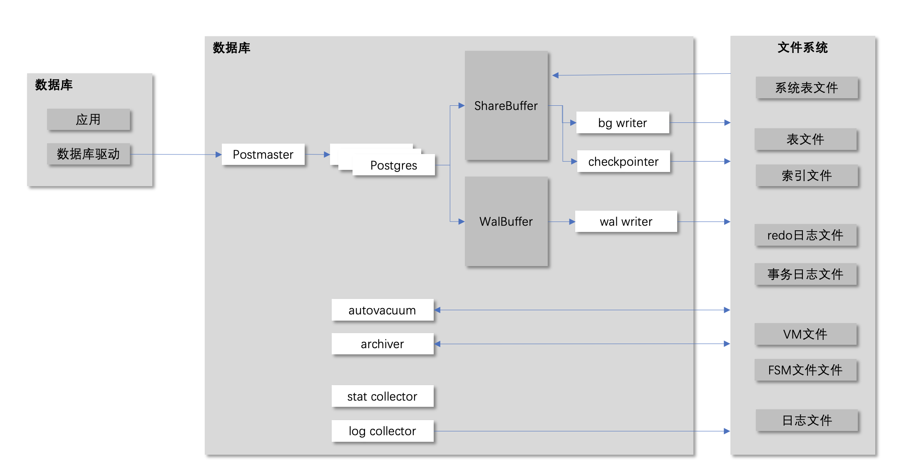

[toc]

# 1 进程架构
## 1.1 进程架构
postgresql 采用1+n+7的进程架构，包括：
- 1个postmaster进程
- n个postgres进程
- 7个辅助进程：包括：
    1. bg writer进程：
    2. checkpointer进程：
    3. walwriter进程：
    4. autovacuum进程：
    5. archiver进程：
    6. statistics collector进程：
    7. log collectoer进程：

进程架构图如下图所示：


## 1.2 进程启动
先启动postmaster进程，再由poastermaster启动n+7进程。
在postmaster主函数中，进程启动顺序如下：
```python
main() # [主进程] 启动postmaster进程
    PostmasterMain()
        pqsignal(SIGUSR1, sigusr1_handler); # 注册信号
        SysLogger_Start()   # [进程7] 启动log collector进程
        StartupDataBase() -> StartupProcessMain() # 进行故障恢复

        ServerLoop()
            BackendStartup()
            SysLogger_Start() # [进程n] 启动posters进程
            StartCheckpointer() -> CheckpointerMain() # [进程2] 启动heckpointer进程
            StartBackgroundWriter() -> BackgroundWriterMain() # [进程1] 启动bg writer进程
            StartWalWriter() -> InitXLOGAccess() WalWriterMain() # [进程3] 启动walwriter进程
            StartAutoVacLauncher() # [进程4] 启动autovacuum进程
            pgstat_start() # [进程6] 启动 statistics collector进程
            pgarch_start() # [进程5] 启动归档进程
            maybe_start_bgworker()
```

## 1.3 进程通信

# 2 进程功能
本章介绍各进程的主要功能。

### 1.2.1 postmaster进程
```c
// 部分辅助进程启动方法
#define StartupDataBase()		StartChildProcess(StartupProcess)
#define StartBackgroundWriter() StartChildProcess(BgWriterProcess)
#define StartCheckpointer()		StartChildProcess(CheckpointerProcess)
#define StartWalWriter()		StartChildProcess(WalWriterProcess)
#define StartWalReceiver()		StartChildProcess(WalReceiverProcess)

StartChildProcess()
    AuxiliaryProcessMain()
        WalWriterMain()
        ...

// 总入口
main() // [进程1]
    PostmasterMain() // 主要功能：进入loop，启动辅助线程，监听应用连接
        pqsignal(SIGUSR1, sigusr1_handler); // 注册wal接受进程信号量
        SysLogger_Start()
        StartupDataBase() -> StartupProcessMain() // 启动进程：故障恢复
        ServerLoop()
            BackendStartup()
            SysLogger_Start()
            StartCheckpointer() -> CheckpointerMain() // [进程5] 检查点进程
            StartBackgroundWriter() -> BackgroundWriterMain() // [进程4] 数据写进程
            StartWalWriter() -> InitXLOGAccess() WalWriterMain() // [进程3] wal写进程
            StartAutoVacLauncher() // [进程6] 清理进程
            pgstat_start() // [进程7]  统计信息进程
            pgarch_start() // [进程8] 归档进程
            maybe_start_bgworker()

// 其中，
sigusr1_handler(PMSIGNAL_START_WALRECEIVER)
    StartWalReceiver()
WaitForWALToBecomeAvailable()
    RequestXLogStreaming()
        SendPostmasterSignal(PMSIGNAL_START_WALRECEIVER)
```
### 1.2.2 postgres进程
### 1.2.3 wal writer进程
```c
main()
    PostmasterMain()
        ServerLoop()
            StartWalWriter() // 主要功能：进入loop，睡眠，满足时被唤醒，将wal写入磁盘
                InitXLOGAccess()
                    GetRedoRecPtr()
                        RedoRecPtr = XLogCtl->RedoRecPtr
                    InitXLogInsert() // 初始化内存
                WalWriterMain()
                    for (;;)
                        XLogBackgroundFlush()
                            LWLockAcquire(WALWriteLock)
                            XLogWrite()
                                curridx = XLogRecPtrToBufIdx(LogwrtResult.Write) // 找到上一次xlog点
                                while (LogwrtResult.Write < WriteRqst.Write) // 计算长度，计算完成后才开始写入
                                    XLogRecPtr EndPtr = XLogCtl->xlblocks[curridx];
                                    LogwrtResult.Write = EndPtr; // 实时更新落盘位置
                                    startidx = curridx;
                                    npage++;
                                    from = XLogCtl->pages + startidx * (Size) XLOG_BLCKSZ; // 计算落盘长度，BLKCZ可配置，1k到6m
                                    if WriteRqst.Write <= LogwrtResult.Write:
                                        write(from, npages * (Size) XLOG_BLCKSZ)
                                        WalSndWakeupRequest()
                                        XLogArchiveNotifySeg()
                                        if (XLogCheckpointNeeded):
                                            RequestCheckpoint(CHECKPOINT_CAUSE_XLOG)
                                curridx = NextBufIdx(curridx)
                            WalSndWakeupProcessRequests()
                                WalSndWakeup()
                            AdvanceXLInsertBuffer() // 扩张wal
                        WaitLatch(WalWriterDelay)
                            WaitLatchOrSocket()
                                select() /* sleep */
```
### 1.2.4 background writer进程
```c
main()
    PostmasterMain()
        ServerLoop()
            StartBackgroundWriter() -> BackgroundWriterMain()
                for (;;) {
                    ResetLatch()

                    BgBufferSync()
                        StrategySyncStart()
                        while () {
                            SyncOneBuffer()
                        }
                    pgstat_send_bgwriter()
                    
                    WaitLatch()
                }

```
### 1.2.5 checkpointer进程
```c
main()
    PostmasterMain()
        ServerLoop()
            StartCheckpointer() -> CheckpointerMain() // 主要功能：进入loop，睡眠，满足条件时被唤醒，将各资源管理器中的内容写入磁盘
                for (;;) {
                    ResetLatch()
                    GetInsertRecPtr()
                    CreateCheckPoint()
                        InitXLogInsert()
                        smgrpreckpt()
                        GetOldestActiveTransactionId()
                        WALInsertLockAcquireExclusive()
                        WALInsertLockRelease()
                        MultiXactGetCheckptMulti()

                        // 先落盘
                        CheckPointGuts()
                            CheckPointCLOG()
                            CheckPointCommitTs()
                            CheckPointSUBTRANS()
                            CheckPointMultiXact()
                            CheckPointPredicate()
                            CheckPointRelationMap()
                            CheckPointReplicationSlots()
                            CheckPointSnapBuild()
                            CheckPointLogicalRewriteHeap()
                            CheckPointBuffers()
                                BufferSync()
                                    while() {
                                        SyncOneBuffer()
                                            FlushBuffer()
                                                XLogFlush()
                                                smgrwrite()
                                    }
                                smgrsync()
                            CheckPointReplicationOrigin()
                            CheckPointTwoPhase()

                        // 再写xlog记录
                        XLogBeginInsert()
                        XLogRegisterData()
                        XLogInsert(RM_XLOG_ID)
                        XLogFlush()
                        // 最后更新控制文件
                        UpdateControlFile()
                        smgrpostckpt()

                    smgrcloseall()

                    CheckArchiveTimeout()
                    pgstat_send_bgwriter()
                    WaitLatch()
                }
```
### 1.2.6 autovacuum进程
### 1.2.7 statistics collector进程
### 1.2.8 archiver进程
### 1.2.9 logging collertor进程

## 1.3 进程通信
```c
typedef struct {
    sig_atomic_t is_set;
    bool is_shared;
    int owner_pid;
} Latch;

WaitLatch(Latch *latch, int wakeEvents, long timeout)
    WaitLatchOrSocket(Latch *latch, int wakeEvents, pgsocket sock, long timeout)
https://cloud.tencent.com/developer/article/2000758
```

# 3 进程控制

pg-internal.vonng.com