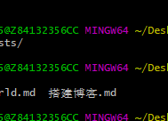

> 说明：原始markdow语法见本文底部

目录：
[toc]

加粗：**test**  
横线：~~test~~  
斜体：*test*  

# 标题：1  
## 标题：1.1  
### 标题：1.1.1  
#### 标题：1.1.1.1  
##### 标题：1.1.1.1.1  
###### 标题：1.1.1.1.1.1  

节点：  
- a  
- b  
    - ba  
  
序号：  
1. a
2. b  
   1. c
   2. d  

分割线  

------------

链接：[点我](http://www.baidu.com "点我")  

链接：[[id]][linkid]  
something  
something   

[linkid]: http://www.baidu.com

图片：  
[](http://www.baidu.com "desc")

引用：
> line 1
> line 2

ada

代码`func(int a, int b)`

代码块：  

```c
    def func(int a, int b)
    {
    	return 0;
    }
```

```python
def func(a, b):
    c = "abc"
    return a + b
```

表格：  
| c1     |    c2  | c3 |
| :- | -: | :-: |
|    1 |    2 | 3|
|    2 |    2 |3|

html转换：
&hearts;

分页符：

[========]

abc

```markdown
目录：
    [toc]

加粗：**test**  
横线：~~test~~  
斜体：*test*  

# 标题：1  
## 标题：1.1  
### 标题：1.1.1  
#### 标题：1.1.1.1  
##### 标题：1.1.1.1.1  
###### 标题：1.1.1.1.1.1  

节点：  
- a  
- b  
    - ba  
  
序号：  
1. a
2. b  
   1. c
   2. d  

分割线  

------------

链接：[点我](http://www.baidu.com "点我")  

链接：[[id]][linkid]  
something  
something   

[linkid]: http://www.baidu.com

图片：  
[](http://www.baidu.com "desc")

引用：
> line 1
> line 2

ada

代码`func(int a, int b)`

代码块：  
```

```markdown
    def func(int a, int b)
    {
    	return 0;
    }


    def func(a, b):
        c = "abc"
        return a + b
```

```markdown
表格：  
| c1     |    c2  | c3 |
| :- | -: | :-: |
|    1 |    2 | 3|
|    2 |    2 |3|

html转换：
&hearts;

分页符：

[========]

abc

```